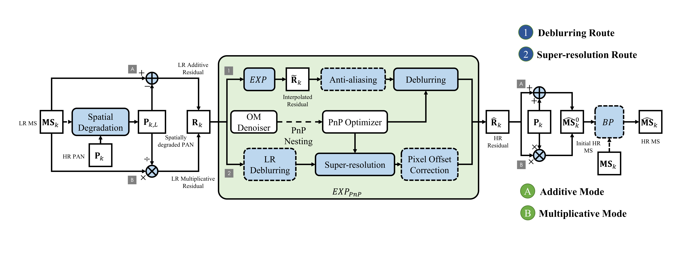

# EXP-PnP: General Extended Model for Detail-injected Pan-sharpening with Plug-and-Play Residual Optimization
This repository contains example code for EXP-PnP.

### Usage
Please add all subfolders in the code to the MATLAB search path and run `EXP-PnP_demo.m`.

### Other Notes
+ For easy demonstration and comparison experiments, the codes of SRCNN, GLP, GLP-HPM-H, etc., are also included in this repository. In addition, a set of example data used in the paper experiments is also included.

+ The data and some third-party tools or functions contained in the code package should be copyrighted to the corresponding authors and organizations.

+ If this code is helpful to your work, please cite our paper: https://doi.org/10.1109/TGRS.2025.3539776

+ For questions, please contact: blueuranus@qq.com.
